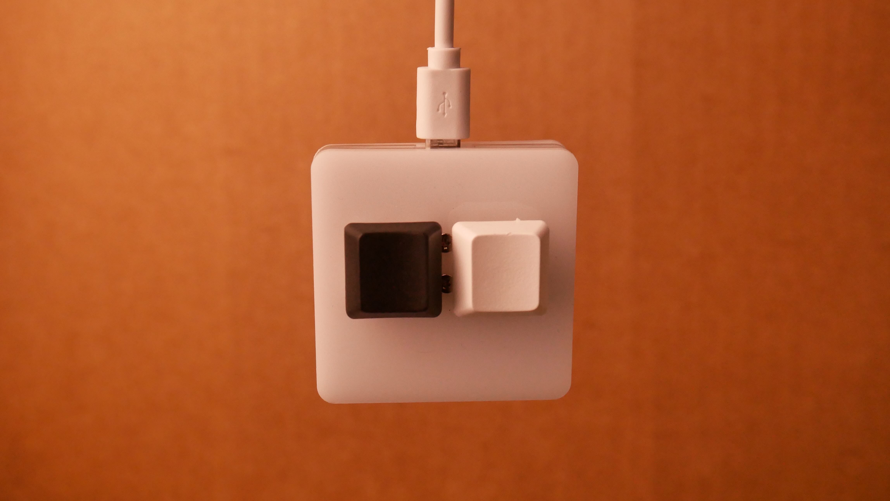
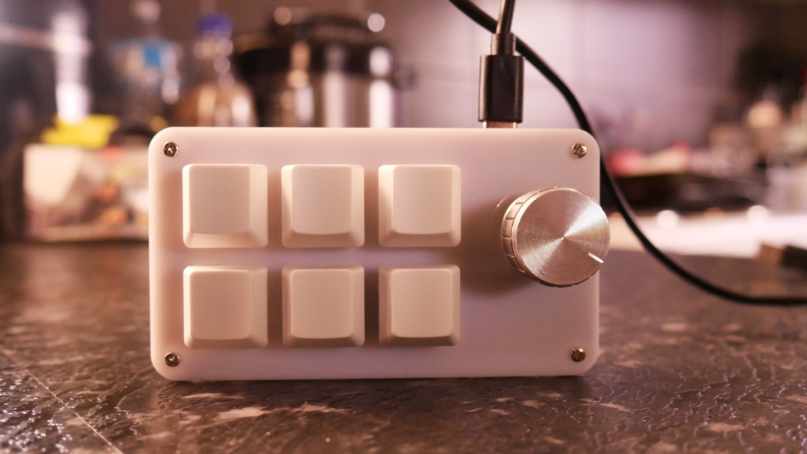
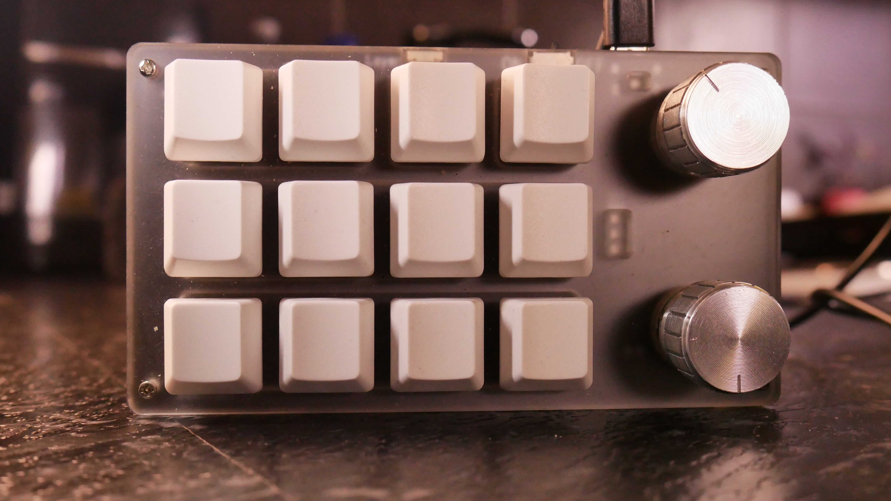
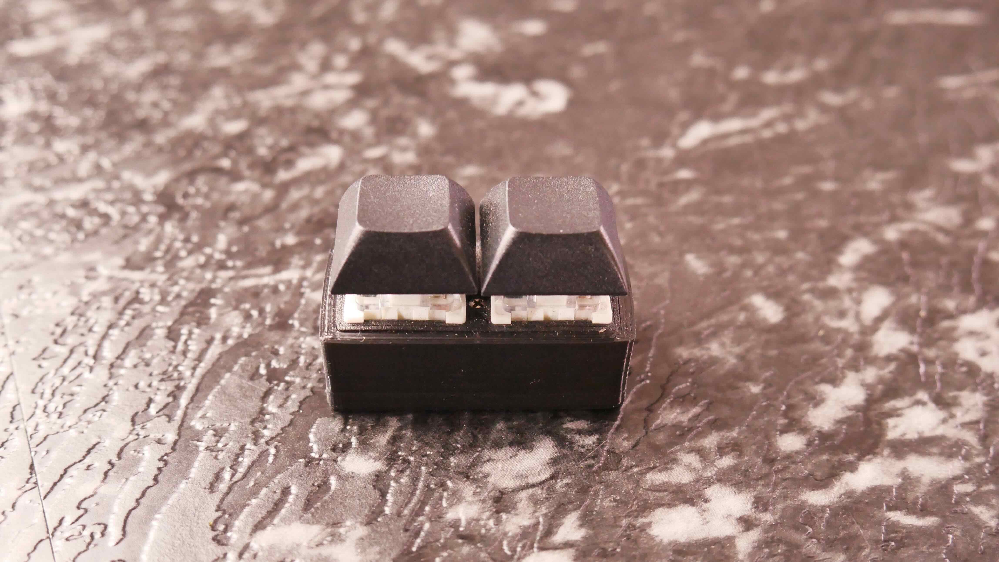

# Macro-keyboard-list-with-softwares

[Sayo device](https://github.com/macrozzz/Sayo-Device-Macro-keyboard)  
 
<a href="https://s.click.aliexpress.com/e/_DF0kb7F" target="_blank">Buy here</a>

 

[hid-tester](https://github.com/macrozzz/hid-tester-macro-keyboard)   

 

[mini-keyboard-macro-keyboard](https://github.com/macrozzz/mini-keyboard-macro-keyboard)   

 

[zdd-macro-keybaord](https://github.com/macrozzz/zdd-macro-keyboard)   

 

# CONTRIBUTE ⬇️⬇️

1. Create your repository in your github
2. Show the keyboard with images
3. Add the software
4. Create a pull request with the link to your github
